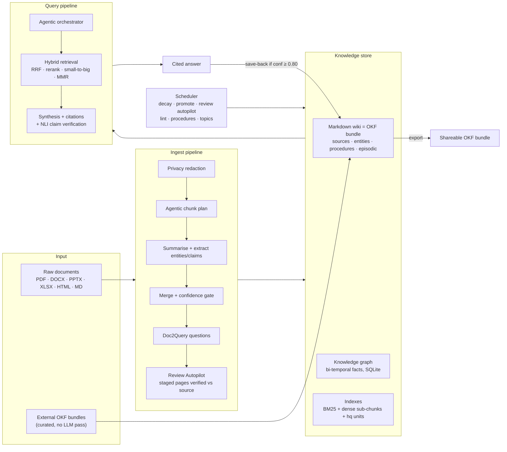
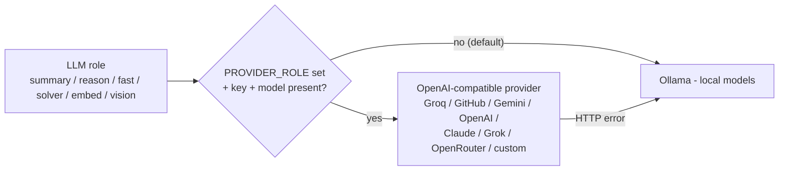
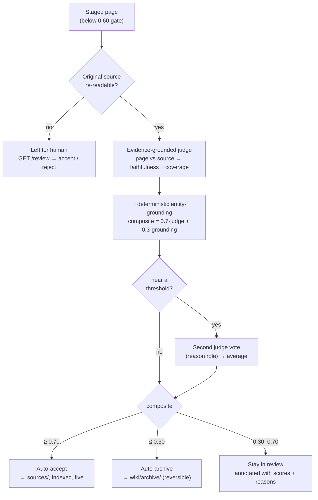

# llm-wiki

> A self-healing local knowledge base where a local LLM compounds your
> documents across four memory tiers — working, episodic, semantic, and
> procedural — with bi-temporal facts, automatic contradiction resolution,
> and scheduled memory maintenance.

`llm-wiki` is a FastAPI service that turns a folder of raw documents into a
**continuously self-organising Markdown wiki**. Drop PDFs, DOCX, PPTX, XLSX,
HTML, or Markdown into the ingest endpoint and the system extracts entities,
claims, and relations; writes confidence-scored pages; and keeps them honest
over time through bi-temporal fact tracking, Ebbinghaus decay, and weekly
self-lint runs.

The wiki conforms to **[Google's Open Knowledge Format (OKF) v0.1](https://github.com/GoogleCloudPlatform/knowledge-catalog/blob/main/okf/SPEC.md)**
— every page carries typed YAML frontmatter and bundle-relative markdown links,
so the whole knowledge base can be exported as a portable OKF bundle (and
external OKF bundles import directly as curated, high-trust pages).

The schema is fully described in [`CLAUDE.md`](./CLAUDE.md) and the agent
tool catalogue in [`AGENTS.md`](./AGENTS.md).

---

## Architecture at a glance



Every LLM call is role-based and provider-agnostic — local Ollama by default,
or any hosted model with one env var (see
[Bring your own model](#bring-your-own-model--the-provider-fleet)):



---

## Why this exists

Most "chat-with-your-docs" stacks throw documents into a vector store and
walk away. After three months they are full of stale claims, duplicate
entities, and dangling references. `llm-wiki` treats the knowledge base as a
**living artefact that has to be maintained** — it promotes recurring ideas,
decays unreinforced ones, supersedes facts when newer sources contradict
older ones, and crystallises repeated query patterns into reusable
procedures.

---

## The four memory tiers

| Tier           | Where                              | Lifetime          | Contents                                              |
|----------------|------------------------------------|-------------------|-------------------------------------------------------|
| **Working**    | in-process state                   | one request       | retrieved candidates, draft answer                    |
| **Episodic**   | `wiki/episodic/<date>.md`          | 14 days (config)  | every ingest / query / lint event with correlation IDs|
| **Semantic**   | `wiki/sources/`, `wiki/entities/`  | indefinite, decays| consolidated pages, auto-generated entity pages       |
| **Procedural** | `wiki/procedures/` + `procedures.db`| indefinite        | recurring query patterns crystallised into procedures |

**Promotion rules:**
- A query becomes part of episodic on every successful answer.
- A topic that recurs ≥ 3 times across ≥ 14 days of episodic auto-promotes
  to semantic via the daily `promote_episodic_to_semantic` job (04:00 UTC).
- A query pattern recurring ≥ 5 times with a similar retrieval set becomes a
  procedure via the weekly `detect_procedures` job (Sun 06:00 UTC).
- A high-confidence answer (≥ 0.80, ≥ 2 citations) is saved back as
  `wiki/sources/synthesis-<slug>.md` immediately at query time.

---

## The ingest pipeline

```
file (PDF/DOCX/PPTX/XLSX/HTML/MD/TXT)
   │
   ▼
load_elements                     ← multi-format loaders, structure-aware
   │
   ▼
privacy redaction                 ← strip API keys / JWTs / private keys / passwords
   │
   ▼
agentic ingest plan               ← adaptive chunk size/overlap by content density
   │
   ▼
layout_aware_chunks               ← atomic tables / images, semantic blocks
   │
   ▼
summarise per chunk (summary)     ← summary-role model extracts entities + relations
   │
   ▼
merge (reason role, 3-tier)       ← reasoning-role model consolidates + scores conf
   │
   ▼
extraction-signal floor           ← rich text → confidence bump
   │
   ▼
contextual preamble (Anthropic)   ← short doc context attached to chunks
   │
   ▼
Doc2Query                         ← the questions this doc answers, indexed as <pid>#hq
   │
   ▼
confidence gate
   │
   ├─ ≥ 0.60 → wiki/sources/<slug>.md
   └─ <  0.60 → wiki/review/<slug>.md   (awaits human accept)
   │
   ▼
upsert entities + relations into graph.db
   │
   ▼
extract S-P-O claims (reason role)  →  add_fact(valid_from=today)
   │
   ▼
contradiction detection vs related pages
   │
   ├─ concrete contradiction → supersede_fact() on older page
   └─ composite-score auto-resolver (margin ≥ 0.2) → keep winner, mark loser
   │
   ▼
reconciler — edits pre-existing pages that overlap on ≥ 2 entities
   │  refines, contradicts, or adds context; staged in wiki/review/edits/
   │
   ▼
media nodes (multimodal graph)    ← tables/images/code/formulas → graph + own embeddings
   │
   ▼
rebuild_index + rebuild_entity_pages
   │
   ▼
episodic_log_entry (correlation_id)
```

Every step is logged in JSON to `logs/app.log`; security-relevant events
(writes, accepts/rejects, contradictions, supersessions) also go to
`logs/audit.log`.

### Review & the Autopilot

Pages scoring below the confidence gate (0.60) land in `wiki/review/` instead of
going live — the ingest-time score is the model's *self-assessment* and errs
cautious. The **Review Autopilot** then closes the loop automatically with a
strictly stronger verification:



1. an LLM judge re-reads the staged page **against the original source document**
   and scores faithfulness + coverage (evidence-grounded, not self-assessed);
2. a deterministic cross-check measures how many of the page's extracted entities
   literally appear in the source (composite = 0.7 × judge + 0.3 × grounding);
3. borderline composites get a **second judge vote** from the reason role
   (a different model when your roles are split) and the votes average;
4. decision: **≥ 0.70 auto-accept** (moved to `sources/`, indexed, audit-logged),
   **≤ 0.30 auto-archive** (moved to `wiki/archive/` — reversible, never deleted),
   **in between → stays in review**, annotated with the judge's scores + reasons
   (visible via `GET /review` and in the page frontmatter as `auto_review`).

It runs inline right after ingest for each staged page, daily at 04:30 UTC for
the backlog, and on demand via `POST /admin/run/review_autopilot`. Pages whose
source can't be re-read (deleted files, machine-generated pages) are always left
for a human. Knobs: `REVIEW_AUTOPILOT_ENABLED`, `REVIEW_ACCEPT_THRESHOLD`,
`REVIEW_REJECT_THRESHOLD`, `REVIEW_SECOND_OPINION`.

For the (now rare) pages left in review: `GET /review` lists them with the
judge's annotation, then `POST /review/{id}/accept` or `/reject` — or use the
dashboard at `/dashboard`.

---

## The query pipeline

```
user question
   │
   ▼
intent classifier                 ← factual / multi_hop / synthesis / exhaustive
   │
   ▼
decompose (if compound)
   │
   ▼
multi-query paraphrase            ← RAG-Fusion: N rewrites
HyDE seed for dense retrieval     ← LLM hallucinates a hypothetical doc
   │
   ▼
hybrid retrieval
   ├─ BM25 over wiki/sources/ (sub-chunks + #hq question units)
   ├─ dense over Chroma (or numpy fallback)
   ├─ RRF fuse
   ├─ FlashRank cross-encoder rerank (graceful passthrough if not installed)
   ├─ small-to-big: rerank the MATCHED sub-chunks ± neighbours, not page[:4000]
   ├─ machine-page down-weight ×0.85 (anti-feedback-loop for save-backs)
   ├─ graph 2-hop expansion via entity links
   └─ MMR diversification
   │
   ▼
mark_accessed() on every retrieved page → reinforces lifecycle counter
   │
   ▼
CRAG relevance filter             ← drop off-topic candidates
   │
   ▼
adaptive model routing            ← quantitative Q → solver reasons, reasoner formats
   │
   ▼
multimodal expansion              ← surface tables/figures linked to retrieved entities
   │
   ▼
lost-in-the-middle reorder        ← ends-load context: best page first, runner-up last
   │
   ▼
synthesis
   ├─ numbered citations
   ├─ [Page]^conf markers per claim
   └─ structured answer blocks
   │
   ▼
grounding check + CRAG ceiling    ← detect ungrounded statements
   │
   ▼
NLI-lite claim verification       ← ONE batched judge call per answer; unsupported
   │                                claims drag per-claim + overall confidence down
   ▼
reflection critique → optional refinement
   │
   ▼
record_query_pattern() in procedural store
   │
   ▼
save-back if confidence ≥ 0.80 ∧ citations ≥ 2
   │
   ▼
episodic_log_entry
```

---

## 2026 adaptive upgrades

Beyond the base pipeline, the system adapts to *what kind* of content and question
it is handling. Each upgrade is flag-gated and degrades gracefully when its model
isn't installed.

| Upgrade | What it does | Flag (default) |
|---|---|---|
| **Adaptive model routing** | Quantitative questions (maths, economics, science, engineering) are reasoned by [VibeThinker](https://github.com/WeiboAI/VibeThinker) — a maths/STEM specialist — then the reasoning-role model formats + cites the result. Plain-English questions skip it. | `ROUTE_SOLVER_ENABLED` (on; self-disables if `MODEL_SOLVER` not served) |
| **Domain detection + tagging** | Every page and query is classified general / math / science / economics / engineering, driving routing and retrieval. | always on |
| **Agentic retrieval** | The `/query` front door auto-routes simple questions to a fast single pass and complex ones to an iterative plan → retrieve → sufficiency-check → gap-rewrite loop. | `AGENTIC_ENABLED` (on) |
| **Agentic ingestion** | Per-document adaptive chunk sizing — dense technical content gets smaller chunks, narrative prose larger. | `INGEST_AGENTIC_PLANNING` (on) |
| **Privacy redaction** | Strips API keys, JWTs, private keys, and passwords from raw sources before ingest; audit-logged as `PRIVACY_REDACT`. | `INGEST_REDACT_SECRETS` (on) |
| **STEM embeddings** | A stronger, notation-aware embedder (`bge-m3`) in a separate dense collection for quantitative content; routed by domain. | `EMBED_STEM_ENABLED` (off) |
| **Multimodal graph** | Tables/images/code/formulas become first-class graph nodes linked to entities and embedded as their own units; retrieval surfaces media linked to the entities in play. | `GRAPH_MULTIMODAL_NODES` (off) |

See [`CLAUDE.md`](./CLAUDE.md) for the schema details and
[`docs/design/multimodal-graph.md`](./docs/design/multimodal-graph.md) for the
multimodal-graph rollout.

---

## Best-of-best RAG package (v5)

Six further techniques, each flag-gated and on by default:

| Technique | What it does | Flag (default) |
|---|---|---|
| **Small-to-big retrieval** | Reranks/synthesises the 1500-char sub-chunks that actually matched (± neighbours), re-derived exactly as indexed — instead of the first 4000 chars of the page. Fixes relevant content beyond the prefix never reaching the LLM. | `QUERY_CHUNK_CONTEXT` (on) |
| **Doc2Query** (Nogueira & Lin) | At ingest, generates the questions each document answers and indexes them as `<pid>#hq`, so question-phrased queries match declarative text. | `INGEST_DOC2QUERY` (on) |
| **Lost-in-the-middle reorder** (Liu et al. 2023) | Ends-loads the synthesis context — best page first, runner-up last — to counter positional attention decay. | `QUERY_LITM_REORDER` (on) |
| **NLI-lite claim verification** | One batched judge call checks every cited claim sentence against its cited snippet; unsupported claims get ×0.35 confidence. Catches "right page, wrong claim". | `QUERY_CLAIM_VERIFY` (on) |
| **Machine-page down-weight** | Synthesis/promoted/crystallized pages score ×0.85 at rerank so save-backs never outrank the primary sources they came from. | `RETRIEVAL_SYNTH_DOWNWEIGHT` (0.85) |
| **RAPTOR-lite topics** (Sarthi et al. 2024) | Weekly clustering of live pages into `topic-*.md` overview pages, so corpus-level questions ("main themes across my documents?") have a retrievable answer. | `JOB_BUILD_TOPICS_ENABLED` (on) |

Pages ingested before v5 need a one-off backfill for the `#hq` units and topics:

```bash
python scripts/backfill_v5.py                  # uses configured models
python scripts/backfill_v5.py --summary-model llama3.2:latest --reason-model llama3.2:latest
```

---

## Evaluation harness

With ~16 stacked techniques, measure what actually pays for its latency on
**your** corpus:

```bash
python scripts/gen_golden.py --n 15            # LLM-generate golden Q/page pairs → eval/golden.jsonl
python scripts/run_eval.py                     # retrieval baseline: recall@k, MRR, hit-rate, latency
python scripts/run_eval.py --ablate            # + one-flag-off variants (chunk-context, MMR, down-weight, graph)
python scripts/run_eval.py --answers           # + full answer eval: keyword coverage, groundedness, confidence
```

Retrieval eval needs only the embedding model (cheap; run per ablation).
Answer eval runs the full pipeline per question. Results land in
`eval/results-<label>.json`. Hand-edit `eval/golden.jsonl` freely — an
LLM-generated golden set inherits its generator's blind spots.

---

## OKF bundles — import & export

The wiki *is* an OKF bundle. Two scripts make that portable:

```bash
# Export the stable tiers (sources/entities/procedures + index.md + log.md)
# as a standalone, validated OKF bundle — share as a git repo or archive:
python scripts/export_okf.py dist/my-wiki-bundle

# Import someone else's OKF bundle as curated pages — no LLM pipeline, pages
# copy 1:1 with provenance stamped, links become RELATES_TO graph edges:
python scripts/import_okf.py path/to/their-bundle
python scripts/import_okf.py path/to/their-bundle --validate-only   # conformance check

# Re-stamp pages written before OKF conformance (idempotent):
python scripts/migrate_okf.py
```

---

## Confidence and decay

- **Stored confidence** is what the LLM assigned at ingest time; reads do
  not mutate it.
- **Effective confidence** = stored × `exp(-Δdays / half_life_days)`, floored
  at 0.05. Default half-life is 90 days.
- **Reinforcement** triggers when a page is accessed ≥ 3 times within a
  14-day window; the reinforcement timestamp resets the decay clock.
- The **decay sweep** (daily 03:00 UTC) rewrites stored confidence based on
  `last_reinforced`.

Bi-temporal facts carry `ingested_at`, optional `valid_from`, optional
`valid_to`, `superseded_by`, `last_reinforced`, and `access_count`. A new
source can never *delete* an old fact — only mark it superseded by setting
`valid_to = today` and `superseded_by = <new_fact_id>`.

Three triggers can supersede:
1. **Reconciler auto-apply** when `action ∈ {refine, contradict}` lands and
   the old text matches.
2. **Contradiction detector** when `_detect_contradictions` returns a
   concrete claim excerpt.
3. **Auto-resolver** (Phase E2) when the composite-score margin ≥ 0.2;
   sub-margin cases stay surfaced in `GET /admin/contradictions` for human
   review.

---

## Scheduled jobs

In-process APScheduler runs the following by default (each toggleable via env
var). Manual one-off runs available via `POST /admin/run/{job_name}`.

| UTC time         | Job                  | Toggle env var                     |
|------------------|----------------------|------------------------------------|
| daily 03:00      | `decay_sweep`        | `JOB_DECAY_SWEEP_ENABLED`          |
| daily 03:30      | `episodic_prune`     | `JOB_EPISODIC_PRUNE_ENABLED`       |
| daily 04:00      | `promote_episodic`   | `JOB_PROMOTE_EPISODIC_ENABLED`     |
| daily 04:30      | `review_autopilot`   | `JOB_REVIEW_AUTOPILOT_ENABLED`     |
| weekly Sun 05:00 | `lint_autofix`       | `JOB_LINT_AUTOFIX_ENABLED`         |
| weekly Sun 06:00 | `detect_procedures`  | `JOB_DETECT_PROCEDURES_ENABLED`    |
| weekly Sun 07:00 | `page_compaction`    | `JOB_PAGE_COMPACTION_ENABLED`      |
| weekly Sun 07:30 | `build_topics`       | `JOB_BUILD_TOPICS_ENABLED`         |

---

## Models

| Role                         | Model                       | Notes                                  |
|------------------------------|-----------------------------|----------------------------------------|
| Summarise, extract           | `gemma4:e4b`                | Fast, strong instruction-following     |
| Reason, route, lint, claims  | `qwen3:14b`                 | Deep reasoning, thinking mode          |
| Quantitative specialist      | `vibethinker:3b`            | AIME-class maths/STEM; routed to adaptively |
| Embeddings                   | `nomic-embed-text:latest`   | 274 MB, MTEB-strong                    |
| STEM embeddings (optional)   | `bge-m3`                    | Notation-aware; `EMBED_STEM_ENABLED`   |
| Vision (image captions)      | `llava:7b`                  | Optional, when `ingest_caption_images` |

Served via Ollama at `OLLAMA_HOST` (default `http://localhost:11434`) by default.

### Bring your own model — the provider fleet

Every LLM role can be pointed at **any** hosted or local provider that speaks the
OpenAI wire format. Clone the repo, copy `.env.example` to `.env`, set
`PROVIDER_<ROLE>` + that provider's key, run — good to go. A role falls back to
Ollama automatically when its key/model is missing, and a provider HTTP error
degrades to the existing Ollama role fallback, so misconfiguration never breaks
the pipeline. Keys live only in your local `.env` (gitignored) — never commit them.

| Provider | `PROVIDER_<ROLE>=` | Key env var | Default model | Embeddings? |
|---|---|---|---|---|
| **Ollama** (default) | `ollama` | — (local) | `qwen3:14b` / `gemma4:e4b` | ✅ `nomic-embed-text` |
| **Groq** | `groq` | `GROQ_API_KEY` | `llama-3.3-70b-versatile` | — |
| **GitHub Models** | `github` | `GITHUB_MODELS_TOKEN` | `openai/gpt-4.1-mini` | — |
| **Google Gemini** | `gemini` | `GOOGLE_GENAI_API_KEY` | `gemini-2.5-flash-lite` | ✅ `text-embedding-004` |
| **OpenAI** | `openai` | `OPENAI_API_KEY` | `gpt-4.1-mini` | ✅ `text-embedding-3-small` |
| **Anthropic Claude** | `anthropic` | `ANTHROPIC_API_KEY` | `claude-sonnet-5` | — |
| **xAI Grok** | `xai` | `XAI_API_KEY` | `grok-4` | — |
| **OpenRouter** | `openrouter` | `OPENROUTER_API_KEY` | `meta-llama/llama-3.3-70b-instruct` (100+ OSS models, one key) | — |
| **Custom / self-hosted** | `custom` | `CUSTOM_API_KEY` (optional) | `CUSTOM_MODEL` @ `CUSTOM_BASE_URL` | ✅ `CUSTOM_EMBED_MODEL` |

`custom` covers **any OpenAI-compatible gateway**: vLLM (`http://localhost:8001/v1`),
LM Studio (`http://localhost:1234/v1`), llama.cpp server, Together, Fireworks,
DeepSeek, Mistral La Plateforme, … — no code changes, no API key needed for local
gateways.

```bash
# Example mixed fleets (set in .env):

# Claude reasons, Groq handles the fast path, everything else local:
PROVIDER_REASON=anthropic   ANTHROPIC_API_KEY=sk-ant-...
PROVIDER_FAST=groq          GROQ_API_KEY=gsk_...

# Fully hosted, zero local GPU:
PROVIDER_REASON=openai      OPENAI_API_KEY=sk-...
PROVIDER_SUMMARY=gemini     GOOGLE_GENAI_API_KEY=...
PROVIDER_EMBED=openai
PROVIDER_FAST=xai           XAI_API_KEY=xai-...

# Your own vLLM box serving an open-source model:
PROVIDER_REASON=custom      CUSTOM_BASE_URL=http://localhost:8001/v1  CUSTOM_MODEL=qwen2.5-72b-instruct
```

Roles: `PROVIDER_SUMMARY` (summarise/extract), `PROVIDER_REASON` (synthesis / deep
reasoning), `PROVIDER_FAST` (fast-agent), `PROVIDER_SOLVER` (quantitative
specialist), `PROVIDER_EMBED` (embeddings), `PROVIDER_VISION` (image captions via
OpenAI `image_url`). All default to `ollama`.

> **Embeddings** are supported by `ollama`, `gemini`, `openai`, and `custom` —
> the other providers expose no embeddings endpoint and fall back to Ollama.
> **Heads-up:** switching embedders mid-corpus requires a re-index (two embedders
> = two incompatible vector spaces).

---

## Quickstart

```bash
git clone https://github.com/krishddd/llm-wiki.git
cd llm-wiki
pip install -r requirements.txt
cp .env.example .env

# Option A — fully local (default): pull the Ollama models
ollama pull qwen3:14b
ollama pull gemma4:e4b
ollama pull nomic-embed-text

# Option B — bring your own model: no Ollama needed, just set a provider in .env
#   PROVIDER_REASON=anthropic  ANTHROPIC_API_KEY=sk-ant-...   (or openai / gemini /
#   groq / github / xai / openrouter / custom — see the provider table above)

# Run the API
uvicorn src.api:app --reload --port 8000
```

Ingest a doc, then ask a question:

```bash
curl -F files=@paper.pdf http://localhost:8000/ingest
curl -X POST http://localhost:8000/query \
     -H 'Content-Type: application/json' \
     -d '{"question": "What did the paper conclude about transformer scaling?"}'
```

Run the agent over MCP:

```bash
python -m src.mcp_server   # exposes ingest / query / lint as MCP tools
```

Trigger a job manually:

```bash
curl -X POST http://localhost:8000/admin/run/promote_episodic
```

---

## Project structure

```
src/
├── api.py                 FastAPI endpoints
├── ingest.py              Multi-format ingest pipeline (+ Doc2Query)
├── query.py               Hybrid retrieval + reflective synthesis + save-back
├── eval_harness.py        Golden-set evaluation: recall@k/MRR + answer quality + ablations
├── lint.py                Health check + auto-fix
├── graph.py               Bi-temporal knowledge graph (SQLite-backed)
├── llm.py                 Async Ollama client (cached embeddings)
├── config.py              pydantic-settings — all knobs
├── logging_config.py      JSON logs + audit channel
├── scheduler.py           APScheduler + JOB_REGISTRY
├── mcp_server.py          Agent-facing MCP wrapper
├── search/                BM25, dense, RRF, FlashRank, MMR, multi-query, intent,
│                          chunks (small-to-big reconstruction)
├── synth/                 Answer blocks, per-claim confidence, claim verify,
│                          reflect, followups
├── loaders/               Multi-format (PDF, DOCX, PPTX, XLSX, HTML, MD, TXT)
│                          + OKF bundle loader
└── wiki/                  Page store (OKF stamping), episodic, promote, procedures,
                           reconciler, lifecycle, contradiction_resolver,
                           entity_pages, topics (RAPTOR-lite), index_md, log_md,
                           okf_export

scripts/
├── migrate_okf.py         Re-stamp pre-OKF pages (idempotent)
├── backfill_v5.py         Backfill #hq units + topic pages for older ingests
├── gen_golden.py          Generate eval/golden.jsonl from the live wiki
├── run_eval.py            Run retrieval/answer eval (+ --ablate variants)
├── import_okf.py          Import an external OKF bundle (curated, no LLM)
└── export_okf.py          Export the wiki as a standalone OKF bundle

wiki/
├── index.md               Auto-regenerated table of contents
├── log.md                 Append-only operation log
├── sources/               Semantic tier — primary citable content
├── entities/              Semantic tier — auto-generated entity pages
├── procedures/            Procedural tier — recurring patterns
├── episodic/<date>.md     Episodic tier — append-only daily logs
├── archive/               Pages auto-moved here by lint auto-fix
├── review/                Confidence-gated drafts awaiting human accept
│   └── edits/             Reconciler-staged edit proposals
└── raw/                   Immutable source documents

data/
├── graph.db               SQLite: entities, relations, facts, page_access
├── procedures.db          SQLite: recurring query patterns
├── bm25.pkl               BM25 index
└── chroma/                ChromaDB persistence (or numpy fallback)

logs/
├── app.log                Rotating JSON, all events
└── audit.log              Filtered audit channel
```

---

## Page frontmatter convention

Conforms to OKF v0.1: `type` (OKF's one required field), `description`,
`resource`, and `timestamp` are stamped centrally by `write_page()` on every
write, so all writers conform automatically.

```yaml
---
title: "Page Title"
kind: source | entity | synthesis | promoted | crystallized | procedure | topic
type: "Source Document" | "Person|Organization|Concept|Place|Event" | "Synthesis" | "Topic Overview"
description: "One-sentence summary (first prose sentence of body if not supplied)"
resource: "wiki/raw/file.pdf"          # OKF URI of the underlying asset
timestamp: "2026-07-15T16:51:36+00:00" # ISO 8601 last modification, auto-stamped
source: "wiki/raw/file.pdf" | "query-save-back" | "episodic-promotion"
ingested: 2026-05-01
confidence: 0.87
confidence_reason: "..."
domain: general | math | science | economics | engineering
tags: [concept, person, org]
entity_refs: ["Entity A", "Entity B"]
hypothetical_questions: ["What does …?"]  # Doc2Query, indexed as <pid>#hq
context_preamble: "..."     # Anthropic Contextual Retrieval
has_tables: true
has_images: false
element_counts: {text: 14, heading: 6, table: 3, image: 0, code: 0}
evolved_by:                 # populated when reconciler edits this page
  - {source: "Foo Doc", action: "refine", date: 2026-05-15}
correlation_ids: [COR-...]  # crystallized / promoted only
---
```

---

## CI & local development

GitHub Actions runs ruff, mypy, pytest (Ollama mocked), and a Docker build on
every push to `main`. Strict ruff config lives in `pyproject.toml`. The
integration suite (`workflows/integration.yml`) is gated behind a manually
triggered `workflow_dispatch` plus a `REMOTE_OLLAMA_HOST` secret, so day-to-day
CI never depends on a live LLM.

---

## Status

Personal research project. Explores how far a local-first LLM-driven wiki
can self-organise without a human curator.

## License

MIT
