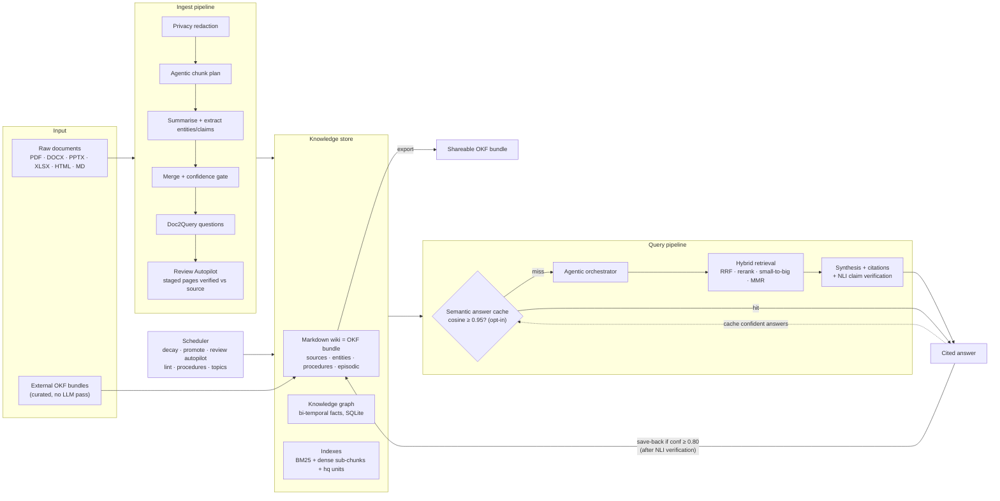
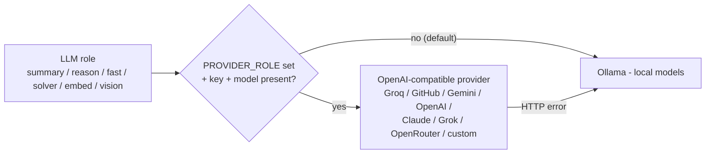
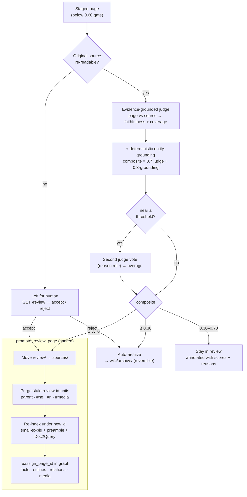
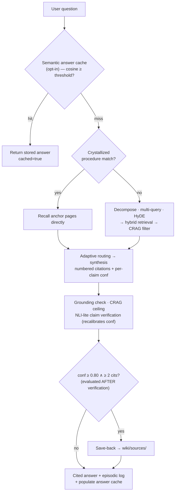

# llm-wiki

[](https://pypi.org/project/llm-compounding-wiki/)
[](https://pypi.org/project/llm-compounding-wiki/)
[](https://krishddd.github.io/llm-wiki/)
[](./LICENSE)

> A self-healing local knowledge base where a local LLM compounds your
> documents across four memory tiers — working, episodic, semantic, and
> procedural — with bi-temporal facts, automatic contradiction resolution,
> and scheduled memory maintenance.

`llm-wiki` is a FastAPI service that turns a folder of raw documents into a
**continuously self-organising Markdown wiki**. Drop PDFs, DOCX, PPTX, XLSX,
HTML, or Markdown into the ingest endpoint and the system extracts entities,
claims, and relations; writes confidence-scored pages; and keeps them honest
over time through bi-temporal fact tracking, Ebbinghaus decay, and weekly
self-lint runs.

The wiki conforms to **[Google's Open Knowledge Format (OKF) v0.1](https://github.com/GoogleCloudPlatform/knowledge-catalog/blob/main/okf/SPEC.md)**
— every page carries typed YAML frontmatter and bundle-relative markdown links,
so the whole knowledge base can be exported as a portable OKF bundle (and
external OKF bundles import directly as curated, high-trust pages).

The schema is fully described in [`CLAUDE.md`](./CLAUDE.md) and the agent
tool catalogue in [`AGENTS.md`](./AGENTS.md).

---

## Architecture at a glance



Every LLM call is role-based and provider-agnostic — local Ollama by default,
or any hosted model with one env var (see
[Bring your own model](#bring-your-own-model--the-provider-fleet)):



---

## Why this exists

Most "chat-with-your-docs" stacks throw documents into a vector store and
walk away. After three months they are full of stale claims, duplicate
entities, and dangling references. `llm-wiki` treats the knowledge base as a
**living artefact that has to be maintained** — it promotes recurring ideas,
decays unreinforced ones, supersedes facts when newer sources contradict
older ones, and crystallises repeated query patterns into reusable
procedures.

---

## The four memory tiers

| Tier           | Where                              | Lifetime          | Contents                                              |
|----------------|------------------------------------|-------------------|-------------------------------------------------------|
| **Working**    | in-process state                   | one request       | retrieved candidates, draft answer                    |
| **Episodic**   | `wiki/episodic/<date>.md`          | 14 days (config)  | every ingest / query / lint event with correlation IDs|
| **Semantic**   | `wiki/sources/`, `wiki/entities/`  | indefinite, decays| consolidated pages, auto-generated entity pages       |
| **Procedural** | `wiki/procedures/` + `procedures.db`| indefinite        | recurring query patterns crystallised into procedures |

**Promotion rules:**
- A query becomes part of episodic on every successful answer.
- A topic that recurs ≥ 3 times across ≥ 14 days of episodic auto-promotes
  to semantic via the daily `promote_episodic_to_semantic` job (04:00 UTC).
- A query pattern recurring ≥ 5 times with a similar retrieval set becomes a
  procedure via the weekly `detect_procedures` job (Sun 06:00 UTC).
- A high-confidence answer (≥ 0.80, ≥ 2 citations) is saved back as
  `wiki/sources/synthesis-<slug>.md` immediately at query time.

---

## The ingest pipeline

```
file (PDF/DOCX/PPTX/XLSX/HTML/MD/TXT)
   │
   ▼
load_elements                     ← multi-format loaders, structure-aware
   │
   ▼
privacy redaction                 ← strip API keys / JWTs / private keys / passwords
   │
   ▼
agentic ingest plan               ← adaptive chunk size/overlap by content density
   │
   ▼
layout_aware_chunks               ← atomic tables / images, semantic blocks
   │
   ▼
summarise per chunk (summary)     ← summary-role model extracts entities + relations
   │
   ▼
merge (reason role, 3-tier)       ← reasoning-role model consolidates + scores conf
   │
   ▼
extraction-signal floor           ← rich text → confidence bump
   │
   ▼
contextual preamble (Anthropic)   ← short doc context attached to chunks
   │
   ▼
Doc2Query                         ← the questions this doc answers, indexed as <pid>#hq
   │
   ▼
confidence gate
   │
   ├─ ≥ 0.60 → wiki/sources/<slug>.md
   └─ <  0.60 → wiki/review/<slug>.md   (awaits human accept)
   │
   ▼
upsert entities + relations into graph.db
   │
   ▼
extract S-P-O claims (reason role)  →  add_fact(valid_from=today)
   │
   ▼
contradiction detection vs related pages
   │
   ├─ concrete contradiction → supersede_fact() on older page
   └─ composite-score auto-resolver (margin ≥ 0.2) → keep winner, mark loser
   │
   ▼
reconciler — edits pre-existing pages that overlap on ≥ 2 entities
   │  refines, contradicts, or adds context; staged in wiki/review/edits/
   │
   ▼
media nodes (multimodal graph)    ← tables/images/code/formulas → graph + own embeddings
   │
   ▼
rebuild_index + rebuild_entity_pages
   │
   ▼
episodic_log_entry (correlation_id)
```

Every step is logged in JSON to `logs/app.log`; security-relevant events
(writes, accepts/rejects, contradictions, supersessions) also go to
`logs/audit.log`.

### Review & the Autopilot

Pages scoring below the confidence gate (0.60) land in `wiki/review/` instead of
going live — the ingest-time score is the model's *self-assessment* and errs
cautious. The **Review Autopilot** then closes the loop automatically with a
strictly stronger verification:



Both accept paths — the Autopilot and the human `POST /review/{id}/accept` — funnel
through the shared **`promote_review_page`** helper, so a promoted page is indexed
exactly like a freshly-ingested one (small-to-big sub-chunks, contextual preamble,
Doc2Query `#hq`, dense metadata) and its knowledge-graph rows follow it to the new id
instead of dangling at the old `review/*` path. Rejection **archives** (reversible),
never hard-deletes.

1. an LLM judge re-reads the staged page **against the original source document**
   and scores faithfulness + coverage (evidence-grounded, not self-assessed);
2. a deterministic cross-check measures how many of the page's extracted entities
   literally appear in the source (composite = 0.7 × judge + 0.3 × grounding);
3. borderline composites get a **second judge vote** from the reason role
   (a different model when your roles are split) and the votes average;
4. decision: **≥ 0.70 auto-accept** (moved to `sources/`, indexed, audit-logged),
   **≤ 0.30 auto-archive** (moved to `wiki/archive/` — reversible, never deleted),
   **in between → stays in review**, annotated with the judge's scores + reasons
   (visible via `GET /review` and in the page frontmatter as `auto_review`).

It runs inline right after ingest for each staged page, daily at 04:30 UTC for
the backlog, and on demand via `POST /admin/run/review_autopilot`. Pages whose
source can't be re-read (deleted files, machine-generated pages) are always left
for a human. Knobs: `REVIEW_AUTOPILOT_ENABLED`, `REVIEW_ACCEPT_THRESHOLD`,
`REVIEW_REJECT_THRESHOLD`, `REVIEW_SECOND_OPINION`.

For the (now rare) pages left in review: `GET /review` lists them with the
judge's annotation, then `POST /review/{id}/accept` or `/reject` — or use the
dashboard at `/dashboard`.

---

## The query pipeline



The linear detail:

```
user question
   │
   ▼
semantic answer cache (opt-in)    ← embed Q; cosine ≥ threshold vs recent answers → return cached
   │                                (complements the EXACT-hash procedural recall)
   ▼
intent classifier                 ← factual / multi_hop / synthesis / exhaustive
   │
   ▼
decompose (if compound)
   │
   ▼
multi-query paraphrase            ← RAG-Fusion: N rewrites
HyDE seed for dense retrieval     ← LLM hallucinates a hypothetical doc
   │
   ▼
hybrid retrieval
   ├─ BM25 over wiki/sources/ (sub-chunks + #hq question units)
   ├─ dense over Chroma (or numpy fallback)
   ├─ RRF fuse
   ├─ FlashRank cross-encoder rerank (graceful passthrough if not installed)
   ├─ small-to-big: rerank the MATCHED sub-chunks ± neighbours, not page[:4000]
   ├─ machine-page down-weight ×0.85 (anti-feedback-loop for save-backs)
   ├─ graph 2-hop expansion via entity links
   └─ MMR diversification
   │
   ▼
mark_accessed() on every retrieved page → reinforces lifecycle counter
   │
   ▼
CRAG relevance filter             ← drop off-topic candidates
   │
   ▼
adaptive model routing            ← quantitative Q → solver reasons, reasoner formats
   │
   ▼
multimodal expansion              ← surface tables/figures linked to retrieved entities
   │
   ▼
lost-in-the-middle reorder        ← ends-load context: best page first, runner-up last
   │
   ▼
synthesis
   ├─ numbered citations
   ├─ [Page]^conf markers per claim
   └─ structured answer blocks
   │
   ▼
grounding check + CRAG ceiling    ← detect ungrounded statements
   │
   ▼
NLI-lite claim verification       ← ONE batched judge call per answer; unsupported
   │                                claims drag per-claim + overall confidence down
   ▼
reflection critique → optional refinement
   │
   ▼
record_query_pattern() in procedural store
   │
   ▼
save-back if confidence ≥ 0.80 ∧ citations ≥ 2   ← evaluated AFTER NLI verification, so a
   │                                               page is never persisted with an inflated score
   ▼
populate semantic answer cache (grounded ∧ conf ≥ min)   [QUERY_ANSWER_CACHE, off by default]
   │
   ▼
episodic_log_entry
```

---

## 2026 adaptive upgrades

Beyond the base pipeline, the system adapts to *what kind* of content and question
it is handling. Each upgrade is flag-gated and degrades gracefully when its model
isn't installed.

| Upgrade | What it does | Flag (default) |
|---|---|---|
| **Adaptive model routing** | Quantitative questions (maths, economics, science, engineering) are reasoned by [VibeThinker](https://github.com/WeiboAI/VibeThinker) — a maths/STEM specialist — then the reasoning-role model formats + cites the result. Plain-English questions skip it. | `ROUTE_SOLVER_ENABLED` (on; self-disables if `MODEL_SOLVER` not served) |
| **Domain detection + tagging** | Every page and query is classified general / math / science / economics / engineering, driving routing and retrieval. | always on |
| **Agentic retrieval** | The `/query` front door auto-routes simple questions to a fast single pass and complex ones to an iterative plan → retrieve → sufficiency-check → gap-rewrite loop. | `AGENTIC_ENABLED` (on) |
| **Agentic ingestion** | Per-document adaptive chunk sizing — dense technical content gets smaller chunks, narrative prose larger. | `INGEST_AGENTIC_PLANNING` (on) |
| **Privacy redaction** | Strips API keys, JWTs, private keys, and passwords from raw sources before ingest; audit-logged as `PRIVACY_REDACT`. | `INGEST_REDACT_SECRETS` (on) |
| **STEM embeddings** | A stronger, notation-aware embedder (`bge-m3`) in a separate dense collection for quantitative content; routed by domain. | `EMBED_STEM_ENABLED` (off) |
| **Multimodal graph** | Tables/images/code/formulas become first-class graph nodes linked to entities and embedded as their own units; retrieval surfaces media linked to the entities in play. | `GRAPH_MULTIMODAL_NODES` (off) |
| **Semantic answer cache** | Embeds each question and short-circuits near-duplicates (cosine ≥ threshold) with a stored answer — a fuzzy layer above the procedural store's EXACT pattern hash. Only grounded, confident answers are cached; entries carry a TTL + count cap. A **staleness guard** re-answers instead of serving a hit whose cited pages have since been archived/rejected/superseded, so a loosely-tuned threshold can never surface an answer built on pages that are gone. | `QUERY_ANSWER_CACHE` (off) |

See [`CLAUDE.md`](./CLAUDE.md) for the schema details and
[`docs/design/multimodal-graph.md`](./docs/design/multimodal-graph.md) for the
multimodal-graph rollout.

---

## Governance & learning

Two capabilities keep the corpus *correct* and let it *learn* — the wiki isn't just
retrieved from, it's governed and improved over time.

### Profile / schema contract (runtime-enforced)

The wiki's conventions — allowed `kind`s, required frontmatter, valid `domain`/type
values, confidence bounds, the entity/relation vocabularies — are a **declarative
contract validated at the page write surface**, not just prose in `CLAUDE.md`. A
malformed page is caught deterministically instead of drifting in.

- **Modes** (`PROFILE_ENFORCEMENT`): `off` · `warn` (default — logs + audits, still
  writes) · `strict` (raises `ProfileViolation` so ingest routes the page to review).
- The built-in `DEFAULT_PROFILE` matches the current schema exactly (nothing the
  pipeline already produces is rejected); override any subset of keys with a
  `PROFILE_PATH` JSON file.
- `GET /profile` shows the active contract; `POST /admin/profile/validate` audits the
  whole live corpus for drift without rewriting anything.

### Feedback curator (corrections → memory)

The episodic tier logs what *happened*; the feedback curator captures what the user
*corrected or preferred* and turns it into durable memory. Submit feedback on an
answer via `POST /feedback`; it is classified (a cheap heuristic drops generic acks
like "thanks" with no LLM call, else one reason-role call):

| Kind | On promotion |
|---|---|
| **correction** | writes a curated high-confidence `sources/feedback-*.md` page, indexed like any source |
| **preference** | becomes an **active preference** injected into every future synthesis prompt ("honour these") |
| **approval** | reinforces the cited page's lifecycle access counter |
| **rejection** | recorded and flagged for review |
| **noise** | dropped |

Promotion is explicit by default (`GET /feedback` → `POST /feedback/{id}/promote` or
`/dismiss`); set `FEEDBACK_AUTO_PROMOTE=true` to auto-apply high-signal
corrections/preferences at capture time. Validated live against hosted models — all
five categories classified correctly, actionable content extracted cleanly.

---

## Best-of-best RAG package (v5)

Six further techniques, each flag-gated and on by default:

| Technique | What it does | Flag (default) |
|---|---|---|
| **Small-to-big retrieval** | Reranks/synthesises the 1500-char sub-chunks that actually matched (± neighbours), re-derived exactly as indexed — instead of the first 4000 chars of the page. Fixes relevant content beyond the prefix never reaching the LLM. | `QUERY_CHUNK_CONTEXT` (on) |
| **Doc2Query** (Nogueira & Lin) | At ingest, generates the questions each document answers and indexes them as `<pid>#hq`, so question-phrased queries match declarative text. | `INGEST_DOC2QUERY` (on) |
| **Lost-in-the-middle reorder** (Liu et al. 2023) | Ends-loads the synthesis context — best page first, runner-up last — to counter positional attention decay. | `QUERY_LITM_REORDER` (on) |
| **NLI-lite claim verification** | One batched judge call checks every cited claim sentence against its cited snippet; unsupported claims get ×0.35 confidence. Catches "right page, wrong claim". | `QUERY_CLAIM_VERIFY` (on) |
| **Machine-page down-weight** | Synthesis/promoted/crystallized pages score ×0.85 at rerank so save-backs never outrank the primary sources they came from. | `RETRIEVAL_SYNTH_DOWNWEIGHT` (0.85) |
| **RAPTOR-lite topics** (Sarthi et al. 2024) | Weekly clustering of live pages into `topic-*.md` overview pages, so corpus-level questions ("main themes across my documents?") have a retrievable answer. | `JOB_BUILD_TOPICS_ENABLED` (on) |

Pages ingested before v5 need a one-off backfill for the `#hq` units and topics:

```bash
python scripts/backfill_v5.py                  # uses configured models
python scripts/backfill_v5.py --summary-model llama3.2:latest --reason-model llama3.2:latest
```

---

## Evaluation harness

With ~16 stacked techniques, measure what actually pays for its latency on
**your** corpus:

```bash
python scripts/gen_golden.py --n 15            # LLM-generate golden Q/page pairs → eval/golden.jsonl
python scripts/run_eval.py                     # retrieval baseline: recall@k, MRR, hit-rate, latency
python scripts/run_eval.py --ablate            # + one-flag-off variants (chunk-context, MMR, down-weight, graph)
python scripts/run_eval.py --answers           # + full answer eval: keyword coverage, groundedness, confidence
```

Retrieval eval needs only the embedding model (cheap; run per ablation).
Answer eval runs the full pipeline per question. Results land in
`eval/results-<label>.json`. Hand-edit `eval/golden.jsonl` freely — an
LLM-generated golden set inherits its generator's blind spots.

---

## Validation — tested end-to-end on hosted models

The pipeline was exercised end-to-end against **NVIDIA `build.nvidia.com`** hosted
models (fully local-GPU-free), routed through the provider fleet — text via
`meta/llama-3.1-8b-instruct`, embeddings via `nvidia/nv-embedqa-e5-v5` (1024-dim).
Every stage ran through a real model, not a mock.

**What was tested and the numbers that came back:**

| Stage tested | Result |
|---|---|
| Provider connectivity (chat + embed) | chat ≈ 0.8 s/call · embed ≈ 0.3 s/call · `/models` auth ✓ |
| Ingest — 3 docs (RAG, vector DBs, Transformers) | all went **live** at **confidence 0.95**; entities + relations + Doc2Query extracted |
| Query retrieval | correct source page retrieved for **every** question |
| Synthesis factual accuracy | facts correct (RAG → Patrick Lewis / Facebook AI / 2020; Transformer → Vaswani / Google / 2017; FAISS/HNSW for vector DBs) |
| Eval harness — recall@5 / MRR / hit-rate | **1.000 / 1.000 / 1.000** across baseline + 4 ablations (chunk-context, MMR, down-weight, graph); ≈ 3–5 s/variant |
| Answer-cache precision @ threshold 0.80 | paraphrase → **cache hit**, unrelated question → **miss** (correct both ways) |
| Unit + integration suite | **145 passed**, ruff-clean |

**Answer-cache threshold, calibrated on real `nv-embedqa` cosines** (replacing the
conservative 0.95 guess — cosine scale is embedder-specific):

| Question pair | Cosine |
|---|---|
| "What is RAG and who introduced it?" ~ "Who created RAG and what is it?" | **0.928** |
| "What are the two components of RAG?" ~ "What are RAG's main parts?" | **0.857** |
| loose reformulation (hallucination wording) | 0.589 |
| RAG question **vs** "How do transformers use attention?" | 0.201 |
| RAG question **vs** "capital of France?" / "quicksort complexity?" | ≈ 0.19–0.20 |

Paraphrases cluster at **0.86–0.93**, unrelated questions at **≈ 0.20** — a wide safe
gap, so **`ANSWER_CACHE_SIM_THRESHOLD ≈ 0.80`** is a high-precision cut for this
embedder (validated live: it hit paraphrases and rejected unrelated questions).

**Honest caveats (what these numbers do and don't prove):**
- The eval corpus was **3 very distinct docs**, so retrieval is trivial and every
  ablation scores a perfect 1.000 — this proves the harness is **push-button and
  correct**, not that any single technique lifts recall. Differentiating the
  techniques needs a larger, more *confusable* corpus.
- `meta/llama-3.1-8b-instruct` is fast but doesn't reliably emit the `[Title]^0.NN`
  citation markers, so `grounded` is penalized (the answer *content* is still
  correct). For production-grade citation/grounding, use a larger reasoner
  (`meta/llama-3.3-70b-instruct` or a `qwen` tier) at the cost of latency.
- Live testing also surfaced a real robustness fix: hosted models emit JSON with
  **literal newlines inside strings** (from `##` markdown), which strict `json.loads`
  rejected — hardened to `strict=False` across all 20 LLM-output parse sites, which
  lifted a query answer from an unparsed blob (confidence 0.2) to clean markdown
  (confidence 0.75). This is exactly the class of bug that only appears under a real
  model.

Reproduce with the NVIDIA block in `.env.example` (`PROVIDER_*=nvidia` + `NVIDIA_API_KEY`),
then the ingest / query / eval commands above.

### Local single-LLM run — vLLM (Nemotron-4B) + hosted reason + OpenAI embeddings

A second end-to-end run exercised a **mixed local/hosted fleet** on a fresh corpus of
3 DOCX files (agent reliability, long-horizon planning, metamorphic testing):

| Role | Provider · model |
|---|---|
| summary / fast / solver | **vLLM** `nvidia/Nemotron-Mini-4B-Instruct` (self-hosted, `custom` provider) |
| reason (synthesis / lint / claim-verify) | **OpenAI** `gpt-4.1-mini` (fast, 128K context) |
| embeddings | **OpenAI** `text-embedding-3-small` |

This split — a tiny self-hosted model for the high-volume per-chunk work, a fast
large-context hosted model for the whole-corpus reasoning, hosted embeddings — is the
practical shape for a single-box setup.

**Results:**

| Endpoint / stage | Result |
|---|---|
| `/ingest` — 3 DOCX | ✅ 3 pages live, **385 entities / 406 relations**, no crash |
| `/query` | ✅ grounded, 3 sources cited **with their tables**, intent `factual`, ~62 s |
| `/query/agentic` | ✅ **HTTP 200 in ~41 s** — 7 sub-queries, multi-hop synthesis, 3 pages cited, clean prose (after the bug fix below) |
| `/lint` | ✅ **HTTP 200 in ~3 s** — surfaced 18 missing entity pages |
| Read endpoints (`/entities`, `/facts/{name}`, `/entities/{id}`, `/context/start`, `/wiki/index`, `/episodic`, `/profile`, `/review`, `/admin/jobs`, `/admin/contradictions`) | ✅ all instant |
| `/admin/profile/validate` | ✅ 370 items checked, 0 violations |
| `/feedback` (POST + GET) | ✅ stored, classified `correction`, actionable text extracted |

**Reason-provider choice mattered — the same two endpoints on other providers:**

| reason provider | `/lint` | `/query/agentic` |
|---|---|---|
| vLLM `Nemotron-Mini-4B` | ❌ `400` (context window too small for whole-corpus prompt) | partial (sub-calls overflow) |
| NVIDIA free-tier `llama-3.3-70b` | ❌ `ReadTimeout` at 600 s (free-tier latency) | ❌ 500 after ~28 min |
| **OpenAI `gpt-4.1-mini`** | ✅ **3 s** | ✅ **41 s** |

**Limits surfaced (all infra/model, not pipeline):**
- **Nemotron-Mini-4B has a small context window** — whole-corpus or snippet-heavy
  prompts (`/lint`, some agentic sub-calls) overflow it and the vLLM returns
  `400 Bad Request`, and the 4B model doesn't reliably emit the `[Title]^0.NN` citation
  schema (raw `/query` answers can come back double-wrapped in JSON). Both clear up once
  the **reason** role is a larger model — the retrieval/citations underneath are correct
  either way. Keep the 4B on the high-volume summary/fast roles where it's a good fit.
- **Free-tier hosted reasoners are latency-bound** — the whole-corpus `/lint` prompt
  exceeds the 600 s client timeout on the NVIDIA free tier. Use a **fast** large-context
  reason provider (OpenAI `gpt-4.1-mini`, Groq) or raise `LLM_TIMEOUT`.
- **`grounded` is strict about citation markers** — `gpt-4.1-mini` cites sources but
  doesn't always emit the literal `[Title]^0.NN` markers the grounding check scans for,
  so the flag can read `false` on an answer that is in fact correct and cited.

**Bug fixed during this run:** the agentic orchestrator temporarily swaps
`QueryEngine._retrieve_one` for a stub during final synthesis, but the stub's signature
didn't accept the `use_mmr` argument the engine passes — so **every** `/query/agentic`
call crashed with `TypeError: _stub() got an unexpected keyword argument 'use_mmr'`.
Fixed in [`llm_wiki/agentic_rag/agentic_query.py`](./llm_wiki/agentic_rag/agentic_query.py)
by making the stub accept (and ignore) extra retrieval kwargs.

---

## OKF bundles — import & export

The wiki *is* an OKF bundle. Two scripts make that portable:

```bash
# Export the stable tiers (sources/entities/procedures + index.md + log.md)
# as a standalone, validated OKF bundle — share as a git repo or archive:
python scripts/export_okf.py dist/my-wiki-bundle

# Import someone else's OKF bundle as curated pages — no LLM pipeline, pages
# copy 1:1 with provenance stamped, links become RELATES_TO graph edges:
python scripts/import_okf.py path/to/their-bundle
python scripts/import_okf.py path/to/their-bundle --validate-only   # conformance check

# Re-stamp pages written before OKF conformance (idempotent):
python scripts/migrate_okf.py
```

---

## Confidence and decay

- **Stored confidence** is what the LLM assigned at ingest time; reads do
  not mutate it.
- **Effective confidence** = stored × `exp(-Δdays / half_life_days)`, floored
  at 0.05. Default half-life is 90 days.
- **Reinforcement** triggers when a page is accessed ≥ 3 times within a
  14-day window; the reinforcement timestamp resets the decay clock.
- The **decay sweep** (daily 03:00 UTC) rewrites stored confidence based on
  `last_reinforced`.

Bi-temporal facts carry `ingested_at`, optional `valid_from`, optional
`valid_to`, `superseded_by`, `last_reinforced`, and `access_count`. A new
source can never *delete* an old fact — only mark it superseded by setting
`valid_to = today` and `superseded_by = <new_fact_id>`.

Three triggers can supersede:
1. **Reconciler auto-apply** when `action ∈ {refine, contradict}` lands and
   the old text matches.
2. **Contradiction detector** when `_detect_contradictions` returns a
   concrete claim excerpt.
3. **Auto-resolver** (Phase E2) when the composite-score margin ≥ 0.2;
   sub-margin cases stay surfaced in `GET /admin/contradictions` for human
   review.

---

## Scheduled jobs

In-process APScheduler runs the following by default (each toggleable via env
var). Manual one-off runs available via `POST /admin/run/{job_name}`.

| UTC time         | Job                  | Toggle env var                     |
|------------------|----------------------|------------------------------------|
| daily 03:00      | `decay_sweep`        | `JOB_DECAY_SWEEP_ENABLED`          |
| daily 03:30      | `episodic_prune`     | `JOB_EPISODIC_PRUNE_ENABLED`       |
| daily 04:00      | `promote_episodic`   | `JOB_PROMOTE_EPISODIC_ENABLED`     |
| daily 04:30      | `review_autopilot`   | `JOB_REVIEW_AUTOPILOT_ENABLED`     |
| weekly Sun 05:00 | `lint_autofix`       | `JOB_LINT_AUTOFIX_ENABLED`         |
| weekly Sun 06:00 | `detect_procedures`  | `JOB_DETECT_PROCEDURES_ENABLED`    |
| weekly Sun 07:00 | `page_compaction`    | `JOB_PAGE_COMPACTION_ENABLED`      |
| weekly Sun 07:30 | `build_topics`       | `JOB_BUILD_TOPICS_ENABLED`         |

---

## Models

| Role                         | Model                       | Notes                                  |
|------------------------------|-----------------------------|----------------------------------------|
| Summarise, extract           | `gemma4:e4b`                | Fast, strong instruction-following     |
| Reason, route, lint, claims  | `qwen3:14b`                 | Deep reasoning, thinking mode          |
| Quantitative specialist      | `vibethinker:3b`            | AIME-class maths/STEM; routed to adaptively |
| Embeddings                   | `nomic-embed-text:latest`   | 274 MB, MTEB-strong                    |
| STEM embeddings (optional)   | `bge-m3`                    | Notation-aware; `EMBED_STEM_ENABLED`   |
| Vision (image captions)      | `llava:7b`                  | Optional, when `ingest_caption_images` |

Served via Ollama at `OLLAMA_HOST` (default `http://localhost:11434`) by default.

### Bring your own model — the provider fleet

Every LLM role can be pointed at **any** hosted or local provider that speaks the
OpenAI wire format. Clone the repo, copy `.env.example` to `.env`, set
`PROVIDER_<ROLE>` + that provider's key, run — good to go. A role falls back to
Ollama automatically when its key/model is missing, and a provider HTTP error
degrades to the existing Ollama role fallback, so misconfiguration never breaks
the pipeline. Keys live only in your local `.env` (gitignored) — never commit them.

| Provider | `PROVIDER_<ROLE>=` | Key env var | Default model | Embeddings? |
|---|---|---|---|---|
| **Ollama** (default) | `ollama` | — (local) | `qwen3:14b` / `gemma4:e4b` | ✅ `nomic-embed-text` |
| **Groq** | `groq` | `GROQ_API_KEY` | `llama-3.3-70b-versatile` | — |
| **GitHub Models** | `github` | `GITHUB_MODELS_TOKEN` | `openai/gpt-4.1-mini` | — |
| **Google Gemini** | `gemini` | `GOOGLE_GENAI_API_KEY` | `gemini-2.5-flash-lite` | ✅ `text-embedding-004` |
| **OpenAI** | `openai` | `OPENAI_API_KEY` | `gpt-4.1-mini` | ✅ `text-embedding-3-small` |
| **Anthropic Claude** | `anthropic` | `ANTHROPIC_API_KEY` | `claude-sonnet-5` | — |
| **xAI Grok** | `xai` | `XAI_API_KEY` | `grok-4` | — |
| **OpenRouter** | `openrouter` | `OPENROUTER_API_KEY` | `meta-llama/llama-3.3-70b-instruct` (100+ OSS models, one key) | — |
| **Custom / self-hosted** | `custom` | `CUSTOM_API_KEY` (optional) | `CUSTOM_MODEL` @ `CUSTOM_BASE_URL` | ✅ `CUSTOM_EMBED_MODEL` |

`custom` covers **any OpenAI-compatible gateway**: vLLM (`http://localhost:8001/v1`),
LM Studio (`http://localhost:1234/v1`), llama.cpp server, Together, Fireworks,
DeepSeek, Mistral La Plateforme, … — no code changes, no API key needed for local
gateways.

```bash
# Example mixed fleets (set in .env):

# Claude reasons, Groq handles the fast path, everything else local:
PROVIDER_REASON=anthropic   ANTHROPIC_API_KEY=sk-ant-...
PROVIDER_FAST=groq          GROQ_API_KEY=gsk_...

# Fully hosted, zero local GPU:
PROVIDER_REASON=openai      OPENAI_API_KEY=sk-...
PROVIDER_SUMMARY=gemini     GOOGLE_GENAI_API_KEY=...
PROVIDER_EMBED=openai
PROVIDER_FAST=xai           XAI_API_KEY=xai-...

# Your own vLLM box serving an open-source model:
PROVIDER_REASON=custom      CUSTOM_BASE_URL=http://localhost:8001/v1  CUSTOM_MODEL=qwen2.5-72b-instruct
```

Roles: `PROVIDER_SUMMARY` (summarise/extract), `PROVIDER_REASON` (synthesis / deep
reasoning), `PROVIDER_FAST` (fast-agent), `PROVIDER_SOLVER` (quantitative
specialist), `PROVIDER_EMBED` (embeddings), `PROVIDER_VISION` (image captions via
OpenAI `image_url`). All default to `ollama`.

> **Embeddings** are supported by `ollama`, `gemini`, `openai`, and `custom` —
> the other providers expose no embeddings endpoint and fall back to Ollama.
> **Heads-up:** switching embedders mid-corpus requires a re-index (two embedders
> = two incompatible vector spaces).

---

## Quickstart

### Install from PyPI

```bash
pip install llm-compounding-wiki          # core pipeline + FastAPI app
pip install "llm-compounding-wiki[mcp]"   # + agent-facing MCP server
pip install "llm-compounding-wiki[ocr]"   # + scanned-PDF OCR (needs Tesseract/Poppler)

llm-wiki serve --port 8000                # run the API (uvicorn llm_wiki.api:app)
llm-wiki mcp                              # run the MCP server
```

The import package is `llm_wiki`; the distribution on PyPI is `llm-compounding-wiki`.

### From source

```bash
git clone https://github.com/krishddd/llm-wiki.git
cd llm-wiki
pip install -e ".[dev]"    # or: pip install -r requirements.txt
cp .env.example .env

# Option A — fully local (default): pull the Ollama models
ollama pull qwen3:14b
ollama pull gemma4:e4b
ollama pull nomic-embed-text

# Option B — bring your own model: no Ollama needed, just set a provider in .env
#   PROVIDER_REASON=anthropic  ANTHROPIC_API_KEY=sk-ant-...   (or openai / gemini /
#   groq / github / xai / openrouter / custom — see the provider table above)

# Run the API
uvicorn llm_wiki.api:app --reload --port 8000
```

Ingest a doc, then ask a question:

```bash
curl -F files=@paper.pdf http://localhost:8000/ingest
curl -X POST http://localhost:8000/query \
     -H 'Content-Type: application/json' \
     -d '{"question": "What did the paper conclude about transformer scaling?"}'
```

Run the agent over MCP:

```bash
python -m llm_wiki.mcp_server   # exposes ingest / query / lint as MCP tools
```

Trigger a job manually:

```bash
curl -X POST http://localhost:8000/admin/run/promote_episodic
```

---

## Project structure

```
llm_wiki/
├── api.py                 FastAPI endpoints
├── ingest.py              Multi-format ingest pipeline (+ Doc2Query)
├── query.py               Hybrid retrieval + reflective synthesis + save-back
├── eval_harness.py        Golden-set evaluation: recall@k/MRR + answer quality + ablations
├── lint.py                Health check + auto-fix
├── graph.py               Bi-temporal knowledge graph (SQLite-backed)
├── llm.py                 Async Ollama client (cached embeddings)
├── config.py              pydantic-settings — all knobs
├── logging_config.py      JSON logs + audit channel
├── scheduler.py           APScheduler + JOB_REGISTRY
├── mcp_server.py          Agent-facing MCP wrapper
├── search/                BM25, dense, RRF, FlashRank, MMR, multi-query, intent,
│                          chunks (small-to-big reconstruction)
├── synth/                 Answer blocks, per-claim confidence, claim verify,
│                          reflect, followups
├── loaders/               Multi-format (PDF, DOCX, PPTX, XLSX, HTML, MD, TXT)
│                          + OKF bundle loader
└── wiki/                  Page store (OKF stamping), episodic, promote, procedures,
                           reconciler, lifecycle, contradiction_resolver,
                           entity_pages, topics (RAPTOR-lite), index_md, log_md,
                           okf_export, review_autopilot, review_promote (shared
                           review→sources promotion), reindex (shared indexing
                           primitives), answer_cache (semantic answer cache)

scripts/
├── migrate_okf.py         Re-stamp pre-OKF pages (idempotent)
├── backfill_v5.py         Backfill #hq units + topic pages for older ingests
├── gen_golden.py          Generate eval/golden.jsonl from the live wiki
├── run_eval.py            Run retrieval/answer eval (+ --ablate variants)
├── import_okf.py          Import an external OKF bundle (curated, no LLM)
└── export_okf.py          Export the wiki as a standalone OKF bundle

wiki/
├── index.md               Auto-regenerated table of contents
├── log.md                 Append-only operation log
├── sources/               Semantic tier — primary citable content
├── entities/              Semantic tier — auto-generated entity pages
├── procedures/            Procedural tier — recurring patterns
├── episodic/<date>.md     Episodic tier — append-only daily logs
├── archive/               Pages auto-moved here by lint auto-fix
├── review/                Confidence-gated drafts awaiting human accept
│   └── edits/             Reconciler-staged edit proposals
└── raw/                   Immutable source documents

data/
├── graph.db               SQLite: entities, relations, facts, page_access
├── procedures.db          SQLite: recurring query patterns
├── answer_cache.db        SQLite: semantic answer cache (opt-in)
├── bm25.pkl               BM25 index
└── chroma/                ChromaDB persistence (or numpy fallback)

logs/
├── app.log                Rotating JSON, all events
└── audit.log              Filtered audit channel
```

---

## Page frontmatter convention

Conforms to OKF v0.1: `type` (OKF's one required field), `description`,
`resource`, and `timestamp` are stamped centrally by `write_page()` on every
write, so all writers conform automatically.

```yaml
---
title: "Page Title"
kind: source | entity | synthesis | promoted | crystallized | procedure | topic
type: "Source Document" | "Person|Organization|Concept|Place|Event" | "Synthesis" | "Topic Overview"
description: "One-sentence summary (first prose sentence of body if not supplied)"
resource: "wiki/raw/file.pdf"          # OKF URI of the underlying asset
timestamp: "2026-07-15T16:51:36+00:00" # ISO 8601 last modification, auto-stamped
source: "wiki/raw/file.pdf" | "query-save-back" | "episodic-promotion"
ingested: 2026-05-01
confidence: 0.87
confidence_reason: "..."
domain: general | math | science | economics | engineering
chunk_count: 14             # sub-chunks indexed — lets re-index / promotion purge exactly
tags: [concept, person, org]
entity_refs: ["Entity A", "Entity B"]
hypothetical_questions: ["What does …?"]  # Doc2Query, indexed as <pid>#hq
auto_review:                # stamped by Review Autopilot (accepted / annotated pages)
  {composite: 0.82, verdict: auto-accepted, faithfulness: 0.9, coverage: 0.8}
context_preamble: "..."     # Anthropic Contextual Retrieval
has_tables: true
has_images: false
element_counts: {text: 14, heading: 6, table: 3, image: 0, code: 0}
evolved_by:                 # populated when reconciler edits this page
  - {source: "Foo Doc", action: "refine", date: 2026-05-15}
correlation_ids: [COR-...]  # crystallized / promoted only
---
```

---

## CI & local development

GitHub Actions runs ruff, mypy, pytest (Ollama mocked), and a Docker build on
every push to `main`. Strict ruff config lives in `pyproject.toml`. The
integration suite (`workflows/integration.yml`) is gated behind a manually
triggered `workflow_dispatch` plus a `REMOTE_OLLAMA_HOST` secret, so day-to-day
CI never depends on a live LLM.

Two more workflows handle release:

- **`publish.yml`** — builds the sdist/wheel and publishes to PyPI via
  [Trusted Publishing](https://docs.pypi.org/trusted-publishers/) (OIDC, no stored
  token) when a GitHub Release is published.
- **`docs.yml`** — builds the MkDocs Material site and deploys it to GitHub Pages
  on every push to `main` that touches the docs.

---

## Status

Personal research project. Explores how far a local-first LLM-driven wiki
can self-organise without a human curator.

## Contributing

Contributions are welcome — see [CONTRIBUTING.md](./CONTRIBUTING.md) for dev
setup, tests, and the release flow. Notable changes are tracked in
[CHANGELOG.md](./CHANGELOG.md).

## License

[MIT](./LICENSE)
