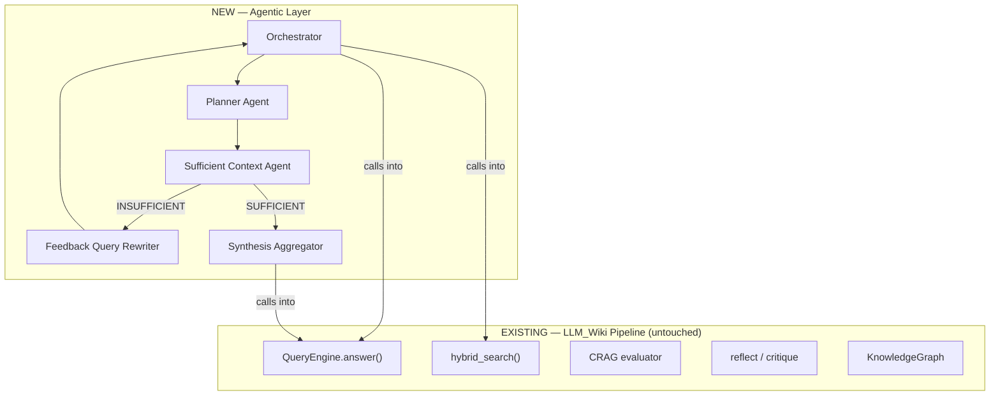
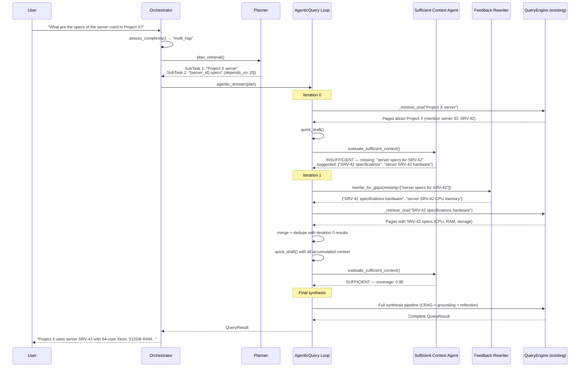

# Agentic RAG Layer for LLM_Wiki

> Adding Google Research's Agentic RAG capabilities **on top** of the existing LLM_Wiki pipeline.
> No existing files are modified — all changes are new additive modules.

---

## Principle

The current LLM_Wiki pipeline (HyDE, CRAG, RAG-Fusion, graph-augmented retrieval, MMR, reflection, per-claim confidence, bi-temporal facts) is already a strong RAG system. The agentic layer wraps around it — calling into the existing `QueryEngine`, `hybrid_search`, and synthesis modules as building blocks.



---

## New Files to Add

All new code goes into a new `src/agents/` package. The existing `src/` modules are imported but never edited.

```
src/
├── agents/                          ← NEW package
│   ├── __init__.py                  ← Package init
│   ├── orchestrator.py              ← Root Agent — routes simple vs complex
│   ├── planner.py                   ← Planner Agent — decomposes & routes
│   ├── sufficient_context.py        ← Sufficient Context Agent (Google's key innovation)
│   ├── feedback_rewriter.py         ← Feedback-driven query rewriter
│   ├── search_fanout.py             ← Parallel search across sub-tasks
│   └── agentic_query.py             ← Main entry point — the iterative loop
```

Plus one config extension and API wiring:

```
src/
├── agents/
│   └── config.py                    ← Agentic-specific settings (extends existing)
├── api_agentic.py                   ← NEW FastAPI router mounted alongside existing
tests/
├── test_agentic.py                  ← Tests for agentic layer
```

---

## Phase 1: Sufficient Context Agent + Iterative Loop (Critical)

> [!IMPORTANT]
> This is the single highest-impact addition. Google attributes their **+34% accuracy** gain primarily to this component. It can work immediately with the existing `QueryEngine` — no other changes needed.

### [NEW] `src/agents/sufficient_context.py`

The core innovation. Evaluates whether retrieved context is **sufficient** to fully answer the question — not just relevant (CRAG already does that) but *complete*.

**Three-part evaluation:**

| Check | What it does | Why CRAG/reflect don't cover this |
|---|---|---|
| **Snippet coverage** | Maps each sub-part of the question to retrieved snippets | CRAG only checks if a page is relevant, not if all question parts are covered |
| **Draft review** | Generates a lightweight draft, checks if it answers everything | Reflect critiques the final answer, but by then it's too late to retrieve more |
| **Gap analysis** | Identifies exactly what's missing + suggests targeted search queries | Reflect finds `missing_aspects` but never uses them for re-retrieval |

```python
@dataclass
class SufficientContextVerdict:
    is_sufficient: bool
    coverage_score: float            # 0.0-1.0 — what fraction of the question is answerable
    reason: str                      # human-readable explanation
    missing_aspects: list[str]       # specific information gaps
    suggested_queries: list[str]     # targeted follow-up queries for re-search
    covered_aspects: list[str]       # what IS already covered (for progress tracking)

async def evaluate_sufficient_context(
    client: OllamaClient,
    *,
    question: str,
    sub_questions: list[str],        # from decomposition
    retrieved_snippets: list[dict],  # page_id + text pairs
    draft_answer: str | None = None, # optional intermediate draft
    iteration: int = 0,
) -> SufficientContextVerdict:
    """Decides if we have enough context to produce a complete, grounded answer."""
```

**Prompt design:** The SCA prompt receives the original question broken into its constituent parts, the retrieved snippet texts, and (optionally) a quick draft. It returns structured JSON with coverage analysis. Uses `qwen3:14b` for its strong reasoning capability.

**Key design decisions:**
- The SCA does **not** call retrieval itself — it only produces a verdict + suggested queries
- The iterative loop in `agentic_query.py` acts on the verdict
- Uses `gemma4:e4b` for the quick draft (fast) and `qwen3:14b` for the verdict (accurate)

---

### [NEW] `src/agents/agentic_query.py`

The iterative retrieval loop — the main entry point for agentic queries. Wraps the existing `QueryEngine` and `hybrid_search`.

```python
MAX_ITERATIONS = 3
COVERAGE_THRESHOLD = 0.85

async def agentic_answer(
    question: str,
    *,
    engine: QueryEngine,          # existing, unchanged
    max_iterations: int = MAX_ITERATIONS,
    coverage_threshold: float = COVERAGE_THRESHOLD,
) -> QueryResult:
    """
    Iterative retrieval loop:

    Iteration 0: Use existing QueryEngine retrieval (decompose + HyDE + RAG-Fusion + hybrid)
    For each iteration 1..N:
        1. Build context from all retrieved pages so far
        2. Generate quick draft from context
        3. Ask SCA: is this sufficient?
        4. If YES → proceed to final synthesis via QueryEngine
        5. If NO → use SCA's suggested_queries for targeted re-search
        6. Merge new results with existing results (dedupe by page_id)

    Final: Call QueryEngine's synthesis/grounding/reflection pipeline on the
           accumulated context.
    """
```

**How it calls into existing code:**
- Uses `engine._decompose()` for initial decomposition
- Uses `engine._retrieve_one()` / `hybrid_search()` for each retrieval pass
- Uses `engine._hyde()` for HyDE on initial query
- Final synthesis reuses the existing synthesis prompt, CRAG, grounding, reflection pipeline
- The `QueryResult` returned is the same dataclass — fully compatible with existing API

**What's new vs existing pipeline:**
- Multiple retrieval passes (existing does exactly 1)
- SCA check between retrieval and synthesis (existing has no sufficiency gate)
- Feedback-driven targeted re-search queries (existing paraphrases only pre-retrieval)
- Accumulated context across iterations (existing sees only first-pass results)

---

### [NEW] `src/agents/feedback_rewriter.py`

Takes the SCA's `missing_aspects` and `suggested_queries` and refines them into optimal search queries for the next retrieval iteration.

```python
async def rewrite_for_gaps(
    client: OllamaClient,
    *,
    original_question: str,
    missing_aspects: list[str],
    previous_queries: list[str],     # avoid repeating the same searches
    suggested_queries: list[str],    # SCA's suggestions
) -> list[str]:
    """Generate targeted search queries for MISSING information.

    Unlike the existing paraphrase() in multi_query.py which rephrase the
    original question, this creates NEW queries aimed at specific gaps.

    Example:
        original: "What are discharge meds, diet restrictions, and allergic reactions for John Doe?"
        missing: ["allergic reactions during hospital stay"]
        previous: ["discharge medications John Doe", "dietary restrictions knee surgery"]
        output: ["allergic reactions adverse events John Doe", "rash anaphylaxis hospital stay"]
    """
```

**Why this is separate from existing `multi_query.py`:**
- `multi_query.paraphrase()` generates rephrasings of the **same question** — it probes the same information from different angles
- `feedback_rewriter.rewrite_for_gaps()` generates queries for **different information** — it targets specific gaps identified by the SCA
- They serve complementary purposes; both are used in the agentic loop

---

## Phase 2: Planner Agent

> [!NOTE]
> Adds strategic retrieval planning — the system decides **how** to search before searching, rather than applying the same fixed pipeline to every query.

### [NEW] `src/agents/planner.py`

Plans retrieval strategy based on query complexity. Works with the existing intent classifier as input but goes further — it produces a structured retrieval plan with dependencies.

```python
@dataclass
class SubTask:
    query: str
    strategy: str                    # "entity_lookup" | "keyword_search" | "graph_traverse" | "fact_check"
    depends_on: list[int]            # indices of prerequisite sub-tasks
    reason: str
    priority: int                    # execution order (lower = first)

@dataclass
class RetrievalPlan:
    sub_tasks: list[SubTask]
    is_multi_hop: bool               # true if any sub-task depends on another's output
    estimated_iterations: int        # hint for max_iterations in the loop
    rationale: str

async def plan_retrieval(
    client: OllamaClient,
    question: str,
    *,
    intent: str,                     # from existing intent classifier
    available_entities: list[str],   # top entities from graph
) -> RetrievalPlan:
    """Strategic query planning.

    For "What are the specs of the server used in Project X?":
    → SubTask 1: "Project X server" (keyword_search, priority=1)
    → SubTask 2: "{server_id} specifications" (entity_lookup, depends_on=[0], priority=2)

    The depends_on field enables chained retrieval — sub-task 2 uses
    results from sub-task 1 to formulate its query.
    """
```

**How it differs from existing `_decompose()`:**
- `_decompose()` is regex-gated and splits into independent sub-queries
- `planner.plan_retrieval()` understands **dependencies** between sub-tasks (multi-hop chains)
- It also selects retrieval **strategy** per sub-task (e.g., graph traversal vs keyword search)

**Integration:** Called from `agentic_query.py` before the first retrieval iteration. The plan's `sub_tasks` replace simple decomposition for complex queries.

---

## Phase 3: Orchestrator + Search Fanout

### [NEW] `src/agents/orchestrator.py`

The top-level router that decides whether a query needs the full agentic pipeline or can go through the existing fast path.

```python
class QueryOrchestrator:
    """Decides: existing pipeline (fast) vs. agentic pipeline (thorough).

    Fast path: simple factual queries → existing QueryEngine.answer() directly
    Agentic path: multi-hop, synthesis, complex → agentic_answer() with SCA loop

    This preserves the existing pipeline's speed for simple queries while
    enabling the agentic loop only when needed.
    """

    def __init__(self, engine: QueryEngine):
        self.engine = engine          # existing, unchanged

    async def process(self, question: str, **kwargs) -> QueryResult:
        complexity = await self._assess_complexity(question)

        if complexity == "simple":
            # Direct to existing pipeline — zero overhead
            return await self.engine.answer(question, **kwargs)

        # Route to agentic pipeline
        return await agentic_answer(
            question,
            engine=self.engine,
            max_iterations=complexity.suggested_iterations,
            **kwargs,
        )
```

**Complexity assessment** uses the existing intent classifier output:
- `factual` → simple (fast path)
- `multi_hop` → complex (agentic path, 2-3 iterations)
- `synthesis` → complex (agentic path, 2 iterations)
- `exhaustive` → complex (agentic path, 1-2 iterations + high top_k)

---

### [NEW] `src/agents/search_fanout.py`

Executes multiple search sub-tasks in parallel, with dependency resolution for multi-hop chains.

```python
async def execute_fanout(
    sub_tasks: list[SubTask],
    *,
    engine: QueryEngine,
    previous_results: dict[int, list] = None,  # results from dependent tasks
) -> dict[int, list[RetrievedPage]]:
    """Execute sub-tasks respecting dependencies.

    Independent tasks run in parallel (asyncio.gather).
    Dependent tasks wait for their prerequisites, then use those
    results to formulate their queries (e.g., extracting an entity ID
    from task 1's results to search in task 2).
    """
```

---

## Phase 4: API Wiring + Configuration

### [NEW] `src/api_agentic.py`

New FastAPI router that mounts alongside the existing `api.py` routes. Adds one new endpoint:

```python
@router.post("/query/agentic")
async def agentic_query(body: QueryRequest) -> QueryResponse:
    """Agentic RAG endpoint — iterative retrieval with SCA.
    Falls back to standard /query for simple questions.
    """
```

The existing `/query` endpoint remains unchanged and continues to work exactly as before.

### [NEW] `src/agents/config.py`

Agentic-specific settings, loaded alongside the existing `config.py`:

```python
class AgenticSettings(BaseSettings):
    agentic_enabled: bool = True
    agentic_max_iterations: int = 3
    agentic_coverage_threshold: float = 0.85
    agentic_quick_draft_model: str = "gemma4:e4b"   # fast model for intermediate drafts
    agentic_sca_model: str = "qwen3:14b"             # reasoning model for SCA
    agentic_complexity_threshold: str = "multi_hop"   # minimum intent to trigger agentic path
    agentic_fanout_concurrency: int = 2               # max parallel sub-task searches
```

---

## Complete File Inventory

| Phase | New File | Purpose | Priority |
|---|---|---|---|
| 1 | `src/agents/__init__.py` | Package init | Critical |
| 1 | `src/agents/sufficient_context.py` | Sufficient Context Agent — the core innovation | Critical |
| 1 | `src/agents/agentic_query.py` | Iterative retrieval loop | Critical |
| 1 | `src/agents/feedback_rewriter.py` | Gap-targeted query rewriting | Critical |
| 2 | `src/agents/planner.py` | Strategic retrieval planning with dependencies | High |
| 3 | `src/agents/orchestrator.py` | Simple vs complex routing | Medium |
| 3 | `src/agents/search_fanout.py` | Parallel sub-task execution | Medium |
| 4 | `src/agents/config.py` | Agentic settings | Medium |
| 4 | `src/api_agentic.py` | New `/query/agentic` endpoint | Medium |
| 4 | `tests/test_agentic.py` | Tests for agentic layer | Medium |

> [!CAUTION]
> **Zero existing files are modified.** All new code imports from the existing modules (`query.QueryEngine`, `search.hybrid.hybrid_search`, `llm.OllamaClient`, etc.) but never changes them.

---

## How the Agentic Loop Works End-to-End

Here's the full flow for a complex query like *"What are the specs of the server used in Project X?"*:



---

## Open Questions

1. **API mounting:** Should the agentic endpoint be a separate `/query/agentic` route, or should it replace the existing `/query` with the orchestrator deciding the path internally? The former is safer (zero risk to existing behavior), the latter is more seamless.

2. **Iteration budget:** Should `max_iterations` be configurable per-request via the API, or fixed globally? Per-request gives callers control but adds complexity.

3. **Procedural memory integration:** Currently, procedural recall in `query.py` bypasses retrieval entirely. Should the agentic loop still run the SCA on procedural recall results, in case the procedure's canonical pages are stale?

4. **MCP tool exposure:** Should the agentic query be exposed as a new MCP tool (e.g., `agentic_query_wiki`), or should the existing `query_wiki` tool be updated to route through the orchestrator?

---

## Verification Plan

### Automated Tests

```bash
# New test file for agentic components
pytest tests/test_agentic.py -v

# Existing tests must still pass (no regressions)
pytest tests/ -v
```

### Manual Verification

1. **Multi-hop test:** Query requiring chained reasoning across 2+ pages. Verify the SCA triggers iteration and finds the full chain.
2. **Partial coverage test:** Compound 3-part question. Verify SCA identifies the missing part and the feedback rewriter generates targeted queries.
3. **Fast path test:** Simple factual query. Verify the orchestrator routes to the existing pipeline with zero overhead.
4. **Latency benchmark:** Compare 10 queries before/after. Target: 0% overhead for simple queries, < 30% for multi-hop.
